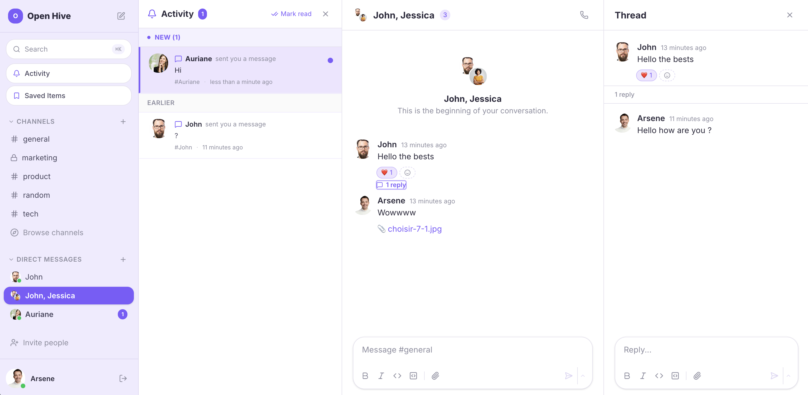
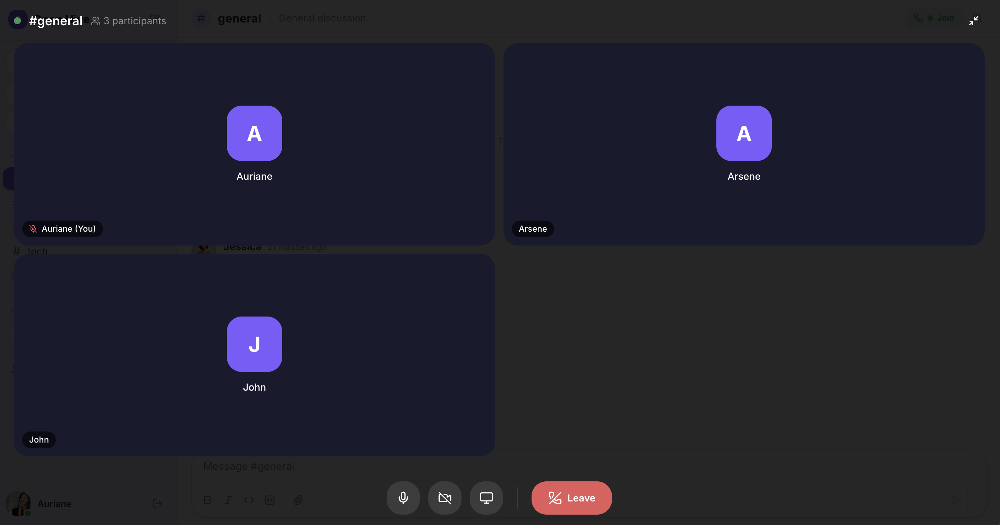
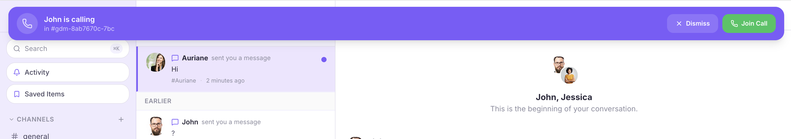
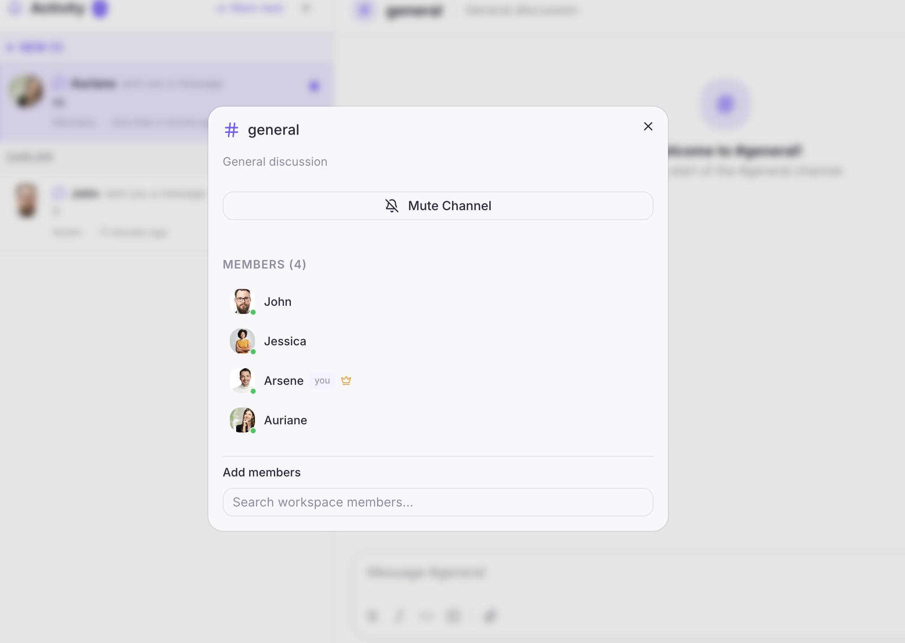

<p align="center">
  
  
  
  
  
</p>

# OpenHive

**Open-source team messaging platform** — a real-time team messaging app anyone can self-host in minutes.

OpenHive is a community-driven project built with Next.js and Supabase. The goal: build a full-featured, beautiful team communication platform that's **100% open-source** and easy to deploy. No vendor lock-in, no hidden costs — bring your own Supabase instance and you're good to go.

> 🚀 **[Try the live demo →](https://www.openhivedemo.com/auth?workspace=022469cb-2e23-4fe4-a462-5da6d55905cd)**

> **We're looking for contributors!** Whether you're a frontend developer, designer, or backend engineer — there's room for everyone. See [Contributing](#contributing) below.

---

## Screenshots

<p align="center">
  
</p>

<p align="center"><em>Workspace overview — channels, activity feed, DMs, and threaded replies</em></p>

<p align="center">
  
</p>

<p align="center"><em>Video & audio calls powered by LiveKit — with screen sharing, mic/camera controls</em></p>

<p align="center">
  
</p>

<p align="center"><em>Incoming call banner with ringtone — dismiss or join in one click</em></p>

<p align="center">
  
</p>

<p align="center"><em>Channel settings — member list with online status, mute, and invite</em></p>

---

## Features

### Messaging
- **Real-time channels** — Public and private channels with instant message delivery via Supabase Realtime
- **Direct messages** — 1-on-1 conversations with online status indicators
- **Group DMs** — Multi-person direct messages with stacked avatars and member management
- **Threaded replies** — Keep conversations organized with message threads
- **Rich text editor** — Bold, italic, inline code, code blocks, and emoji picker (powered by TipTap)
- **Emoji reactions** — React to messages with any emoji
- **File attachments** — Upload and share images and files (Supabase Storage)
- **@mentions** — Mention users with autocomplete; mentions display real names inline
- **Message editing & deletion** — Edit or delete your own messages
- **Message bookmarks** — Save any message for later; access saved items from the sidebar
- **Message scheduling** — Schedule messages to be sent at a future date/time with presets or custom picker

### Channels & Organization
- **Public channels** — Open to all workspace members
- **Private channels** — Invite-only channels with lock icon
- **Channel settings** — Edit topic, description, manage members
- **Browse channels** — Discover and preview channels before joining
- **Mute channels** — Mute notifications per channel
- **Unread indicators** — Badge counts for unread messages

### Video & Audio Calls
- **Channel calls** — Start a video/audio call in any channel
- **DM calls** — Call any team member directly from a DM conversation
- **Group DM calls** — Video calls in group conversations
- **Screen sharing** — Share your screen during calls
- **Camera & mic controls** — Toggle camera, microphone, and screen share
- **Call indicators** — Green phone icon in sidebar when a call is active
- **Incoming call banner** — Audio ringtone + join/dismiss banner when someone calls
- **Minimized mode** — Collapse the call to a floating bar while chatting
- **Setup detection** — Friendly dialog when LiveKit is not configured (instead of silent failure)
- Powered by [LiveKit](https://livekit.io) (open-source WebRTC)

### Slash Commands
- **Built-in commands** — `/shrug`, `/me`, `/mute`, `/unmute` available out of the box
- **Command picker** — Type `/` to see available commands with keyboard navigation
- **Custom commands** — Admins can create workspace-specific commands with webhook handlers
- **Extensible** — Easy to add new built-in or custom commands

### Webhooks & Bots
- **Incoming webhooks** — POST JSON to a generated URL to send messages to any channel
- **Outgoing webhooks** — Trigger HTTP callbacks on events (new messages, reactions, etc.)
- **Bot framework** — Create bots with custom names, avatars, and channel subscriptions
- **Webhook management** — Full CRUD in workspace settings with delivery logs

### Team & Workspace
- **Workspace creation** — Create your team workspace with auto-provisioned channels (#general, #random)
- **Email invitations** — Invite team members via email with magic links
- **User profiles** — Avatar, display name, status emoji, bio
- **Online presence** — Real-time online/offline status for all members
- **Workspace settings** — Manage description, calls, webhooks, bots, and slash commands (admin only)
- **Role-based access** — Owner, admin, and member roles
- **Password reset** — Full forgot/reset password flow with email recovery

### Notifications & Activity
- **Activity panel** — Centralized feed of mentions, DMs, thread replies, and reactions
- **Unread/read sections** — Clear visual separation between new and earlier activities
- **Pagination** — Load activities in batches of 20 with "Show more"
- **Individual read tracking** — Click an activity to mark it as read; bulk "Mark all read" button
- **Browser notifications** — Desktop notifications for mentions and DMs (when window not focused)
- **Unread tracking** — Per-channel unread message counts with read receipts
- **Auto-read** — Activities auto-mark as read when you navigate to the relevant channel

### Search
- **Full-text search** — Search across all messages and channels
- **Quick navigation** — `Cmd+K` / `Ctrl+K` to quickly find channels, DMs, and messages

### Mobile & Responsive
- **Fully responsive** — Works on mobile (< 768px), tablet (768px–1024px), and desktop (> 1024px)
- **Sidebar drawer** — Slide-out sidebar on mobile and tablet with backdrop overlay
- **Hamburger menu** — Accessible navigation toggle on smaller screens
- **Touch-friendly** — Properly sized tap targets and mobile-optimized inputs

### Security
- **Server-side auth** — Next.js middleware protects all workspace and API routes; all API endpoints verify caller identity via JWT
- **XSS protection** — Message content sanitized with DOMPurify; mention popup HTML-escaped to prevent stored XSS
- **Input validation** — API routes validate and sanitize all inputs (email format, file MIME types, path traversal prevention, text length limits)
- **Row Level Security** — All 23+ database tables secured with fine-grained Supabase RLS policies (co-worker scoping, admin-only writes, self-only mutations)
- **PKCE auth flow** — Secure authentication code exchange with proper password recovery detection
- **File upload hardening** — MIME type allowlist, file size limits (5 MB avatars / 50 MB attachments), path sanitization
- **Identity verification** — LiveKit tokens use server-verified user IDs (no client-side identity spoofing)
- **Role-based API protection** — Invite and provisioning endpoints enforce admin/owner roles; provisioning locked in production
- **Webhook input sanitization** — Incoming webhook text length capped, usernames stripped of HTML tags

---

## Tech Stack

| Layer | Technology |
|-------|-----------|
| **Framework** | [Next.js 16](https://nextjs.org) (App Router) |
| **Language** | TypeScript |
| **UI** | [shadcn/ui](https://ui.shadcn.com) + [Tailwind CSS](https://tailwindcss.com) |
| **Editor** | [TipTap](https://tiptap.dev) (rich text) |
| **State** | [Zustand](https://zustand-demo.pmnd.rs/) |
| **Backend** | [Supabase](https://supabase.com) (PostgreSQL, Auth, Realtime, Storage) |
| **Video Calls** | [LiveKit](https://livekit.io) (open-source WebRTC) |
| **Sanitization** | [DOMPurify](https://github.com/cure53/DOMPurify) |
| **Icons** | [Lucide](https://lucide.dev) |
| **Date** | [date-fns](https://date-fns.org) |

---

## Getting Started

### Prerequisites

- **Node.js** 18+
- **npm** (or pnpm/yarn)
- A **Supabase** account (free tier works fine) — [supabase.com](https://supabase.com)

### 1. Clone the repo

```bash
git clone https://github.com/arseneHuot/openhive.git
cd openhive
npm install
```

### 2. Start the dev server

```bash
npm run dev
```

Open [http://localhost:3000](http://localhost:3000) — you'll see the **setup wizard**.

### 3. Connect your Supabase project

The setup wizard will guide you through connecting your own Supabase instance:

1. **Create a Supabase project** at [supabase.com/dashboard](https://supabase.com/dashboard)
2. Go to **Settings > API** in your Supabase dashboard
3. Copy your **Project URL** and **anon public key**
4. Go to **Settings > Access Tokens** and generate a **Personal Access Token** (starts with `sbp_...`)
5. Enter all three values in the setup wizard

The wizard will:
- Validate your credentials
- **Auto-provision all 23 database tables**, RLS policies, triggers, and functions
- Enable Realtime on the required tables
- In dev mode: write your config to `.env.local` (gitignored, never committed)
- In production: display the env vars to copy into your hosting platform

> **Note:** The Personal Access Token is used **once** during provisioning and is **never stored**.

### 4. Restart and sign up

**Local development:** After provisioning, restart the dev server (`Ctrl+C` then `npm run dev`), create an account, and start chatting!

**Production (Vercel, etc.):** The wizard will show the env vars to set — see [Deployment](#deployment) below.

---

## Configuring Video Calls (LiveKit)

Video/audio calls are powered by [LiveKit](https://livekit.io), an open-source WebRTC platform. This is **optional** — messaging works without it.

### Option A: LiveKit Cloud (easiest)

1. Sign up at [cloud.livekit.io](https://cloud.livekit.io) (free tier available)
2. Create a new project
3. Copy your **Server URL**, **API Key**, and **API Secret**

### Option B: Self-hosted LiveKit

1. Follow the [LiveKit self-hosting guide](https://docs.livekit.io/home/self-hosting/local/)
2. Use your self-hosted server URL and generated API credentials

### Enable calls in OpenHive

1. Open your workspace in OpenHive
2. Click the workspace name (top-left) > **Workspace Settings**
3. Scroll to **Video Calls (LiveKit)**
4. Enter your LiveKit **Server URL**, **API Key**, and **API Secret**
5. Check **"Enable calls for this workspace"**
6. Click **Save**

That's it! The phone icon will appear in channel headers and DM conversations. If LiveKit is not configured, users will see a helpful dialog explaining how to set it up.

---

## Project Structure

```
src/
├── app/                        # Next.js App Router
│   ├── api/
│   │   ├── setup/              # POST: writes .env.local (dev only)
│   │   ├── provision/          # Database provisioning endpoint
│   │   ├── livekit/token/      # LiveKit token generation
│   │   ├── invite/             # Email invitation system
│   │   ├── storage/            # Storage bucket management
│   │   ├── upload/             # File upload handling
│   │   └── webhook/[id]/       # Incoming webhook receiver
│   ├── setup/                  # Setup wizard UI
│   ├── auth/                   # Sign in / Sign up / Forgot password / Reset
│   └── workspace/              # Main app (authenticated)
├── components/
│   ├── ui/                     # shadcn/ui components
│   ├── activity/               # Activity panel (mentions, DMs, reactions)
│   ├── bookmarks/              # Saved items panel
│   ├── calls/                  # Video call panel, incoming call banner, setup dialog
│   ├── chat/                   # Messages, input, threads, slash commands, scheduling
│   ├── profile/                # User profile editing
│   ├── search/                 # Search dialog
│   ├── sidebar/                # Sidebar, channel list, DMs, group DMs, browse
│   └── workspace/              # Workspace creation, settings, webhooks, bots
├── hooks/
│   ├── use-mobile.ts           # Responsive breakpoint detection
│   ├── use-notifications.ts    # Browser notification & activity tracking
│   ├── use-presence.ts         # Online presence tracking
│   └── use-scheduled-messages.ts # Scheduled message polling & sending
├── lib/
│   ├── supabase/
│   │   ├── client.ts           # Supabase browser client
│   │   ├── server.ts           # Supabase server client (middleware)
│   │   ├── provisioner.ts      # DB provisioning via Management API
│   │   └── migrations.ts       # All 23+ table definitions + RLS
│   ├── store/
│   │   └── app-store.ts        # Zustand global state
│   └── slash-commands.ts       # Built-in slash command registry
├── middleware.ts                # Auth protection for routes
└── types/
    └── database.ts             # TypeScript types for all tables
```

---

## Database Schema

OpenHive auto-provisions **23+ tables** with full RLS (Row Level Security):

**Core:**
`profiles` · `workspaces` · `workspace_members` · `channels` · `channel_members` · `messages` · `reactions` · `file_attachments` · `pins` · `read_receipts`

**Calls & Presence:**
`workspace_settings` · `active_calls` · `call_participants`

**Integrations:**
`incoming_webhooks` · `outgoing_webhooks` · `webhook_delivery_logs` · `bots` · `bot_channel_memberships` · `bot_event_subscriptions` · `slash_commands`

**Extended:**
`reminders` · `shared_channel_links` · `remote_profiles` · `saved_items` · `scheduled_messages`

All migrations are in `src/lib/supabase/migrations.ts` — the setup wizard runs them automatically.

---

## Deployment

### Vercel (recommended)

You can deploy OpenHive to Vercel in two ways:

#### Option A: Provision first, then deploy

1. **Run locally** first: `npm run dev` → complete the setup wizard to provision your database
2. Push your code to GitHub
3. Import the repo in [Vercel](https://vercel.com)
4. Add environment variables in Vercel dashboard:
   - `NEXT_PUBLIC_SUPABASE_URL` — your Supabase project URL
   - `NEXT_PUBLIC_SUPABASE_ANON_KEY` — your Supabase anon key
   - `SUPABASE_SERVICE_ROLE_KEY` — *(optional)* needed for email invitations and file uploads
5. Deploy!

#### Option B: Provision directly on Vercel

1. Push your code to GitHub and import in [Vercel](https://vercel.com)
2. Deploy **without** environment variables — the app will show the setup wizard
3. Open your deployed URL → the setup wizard provisions the database
4. After provisioning, the wizard displays the env vars to set
5. Copy them into **Vercel dashboard > Settings > Environment Variables**
6. Redeploy (or trigger a redeployment) for the env vars to take effect

> **Note:** The setup wizard provisions the database via the Supabase Management API using your Personal Access Token. The token is used **once** and is **never stored**. In production, `.env.local` cannot be written — the wizard shows the values to set in your hosting platform instead.

#### Configure Supabase Site URL (important for email invitations)

After deploying, update your Supabase project so invitation and password-reset emails point to your production domain (not `localhost`):

1. Go to **Supabase Dashboard** → **Authentication** → **URL Configuration**
2. Set **Site URL** to your production URL (e.g., `https://your-app.vercel.app`)
3. Add your production URL and `http://localhost:3000` to the **Redirect URLs** list

Without this step, invitation emails will contain `localhost` links that won't work for your users.

#### Configure a custom SMTP (recommended)

Supabase's built-in email service has strict rate limits (3–4 emails/hour on the free plan). For production, set up a custom SMTP provider so invitations and password resets are delivered reliably:

1. Go to **Supabase Dashboard** → **Project Settings** → **Authentication** → **SMTP Settings**
2. Enable **Custom SMTP**
3. Enter your SMTP credentials

**Recommended provider:** [Resend](https://resend.com) — generous free tier (3 000 emails/month), simple setup, and works great with Supabase. Other options: SendGrid, Mailgun, Amazon SES, Postmark.

> **Without a custom SMTP**, Supabase uses its default email service which is rate-limited and emails may land in spam. Setting up a proper SMTP provider ensures your team's invitation and password reset emails are delivered instantly.

### Other platforms

OpenHive runs anywhere Node.js runs — Railway, Fly.io, Docker, AWS, etc.

1. Deploy the app
2. Open the deployed URL → complete the setup wizard to provision the database
3. Set the displayed environment variables in your platform
4. Redeploy

Or provision locally first, then set the env vars and run `npm run build && npm start`.

---

## Contributing

**OpenHive is a community project — we want as many contributors as possible!**

Whether you're fixing a typo, adding a feature, or improving the docs — every contribution matters. Here's how to get involved:

### Quick start

1. **Fork** the repository
2. **Clone** your fork: `git clone https://github.com/YOUR_USERNAME/openhive.git`
3. **Create a branch**: `git checkout -b feature/my-awesome-feature`
4. **Make your changes** and test locally
5. **Commit**: `git commit -m "Add my awesome feature"`
6. **Push**: `git push origin feature/my-awesome-feature`
7. **Open a Pull Request** on the main repo

### What can you work on?

- **New features** — Check the [Issues](https://github.com/arseneHuot/openhive/issues) tab for feature requests
- **Bug fixes** — Found a bug? Fix it and submit a PR
- **UI/UX improvements** — Better animations, responsive design, accessibility
- **Documentation** — Improve docs, add examples, translate
- **Testing** — Add unit tests, integration tests, E2E tests
- **Performance** — Optimize rendering, reduce bundle size
- **Integrations** — Webhooks, bots, slash commands, third-party services

### Ideas for future features

- [ ] Custom emoji
- [ ] Channel categories / folders
- [ ] Voice messages
- [ ] End-to-end encryption
- [ ] PWA support (install as app)
- [ ] Internationalization (i18n)
- [ ] Themes (dark mode, custom colors)
- [ ] Guest access (external users)
- [ ] SAML/SSO authentication
- [ ] Audit logs
- [ ] Data export
- [ ] Message pinning improvements
- [ ] Typing indicators
- [ ] Read receipts UI
- [ ] User status / away mode

### Guidelines

- Keep PRs focused — one feature or fix per PR
- Follow the existing code style (TypeScript, Tailwind, shadcn/ui)
- Test your changes locally before submitting
- Write clear commit messages
- Be kind and respectful in discussions

See [CONTRIBUTING.md](CONTRIBUTING.md) for detailed guidelines.

---

## Community

- **GitHub Issues** — [Report bugs & request features](https://github.com/arseneHuot/openhive/issues)
- **GitHub Discussions** — [Ask questions & share ideas](https://github.com/arseneHuot/openhive/discussions)
- **Pull Requests** — [Contribute code](https://github.com/arseneHuot/openhive/pulls)

---

## License

OpenHive is open-source software licensed under the [MIT License](LICENSE).

---

<p align="center">
  Built with Next.js, Supabase & LiveKit<br/>
  <strong>Star the repo if you like the project!</strong>
</p>
# Crewwork

